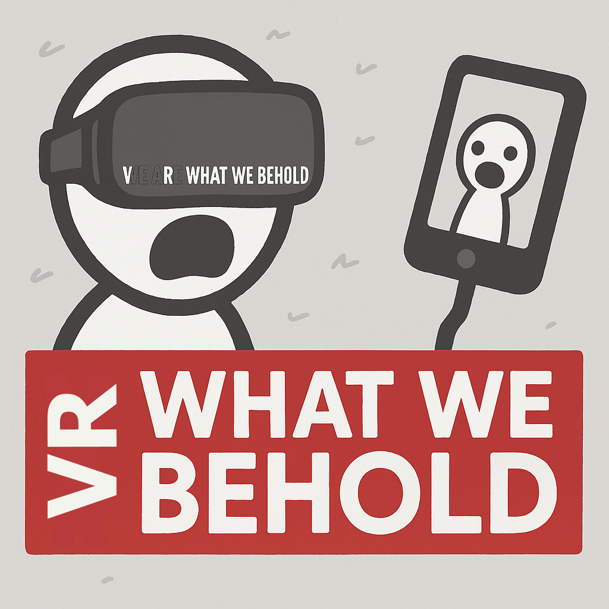
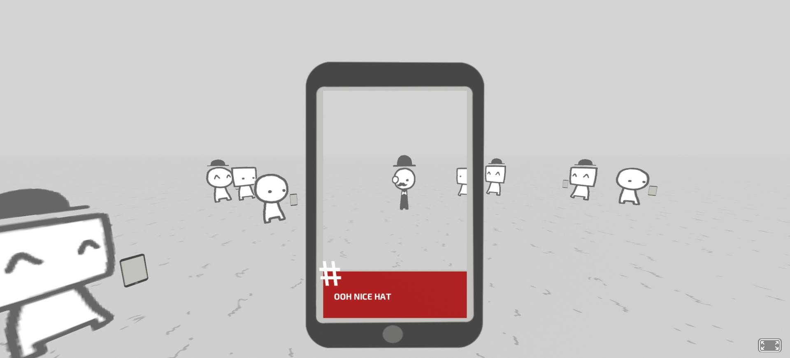
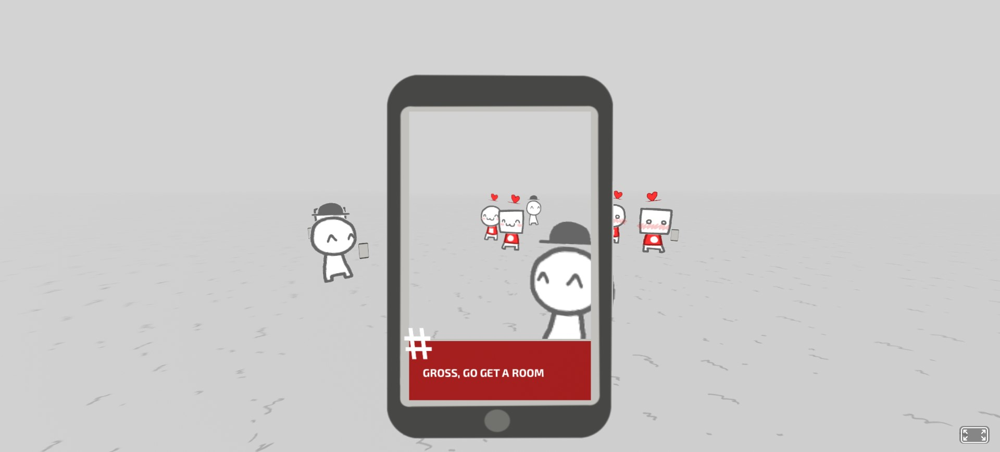
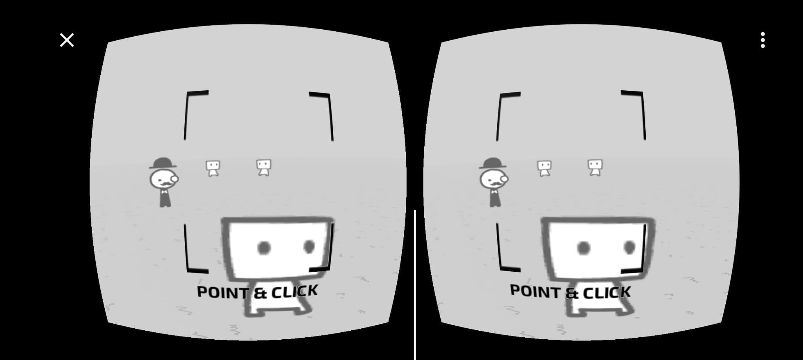

**_Prototype Phase_**

Test the latest prototype I tested in VR: https://anjomorto.itch.io/vrwwb-t. 
**Password:** VR-access
_Dev Mode (skip cooldowns -may cause sync bugs-, and see Peep's ID's)_:
"d" on keyboard, "up arrow/up d-pad" on remote

    

 

# VR What We Behold 

**Fan quasi-VR-port of _We Become What We Behold_**  

An experimental virtual-reality adaptation of Nicky Case’s satirical " _game about news cycles, vicious cycles, infinite cycles_ ".
In a VR headset or desktop mode, you aim your phone camera  at wandering peeps, snap a photo, and watch how your posts alters their behaviour.

    

---

## New Features

- **Head-tracked aiming** (or mobile gyroscope or mouse) 
- **Controller support**
- **Any platform with WebXR/VR browser support**
- **Social Media like capture instead of TV**

    

---

## How to Run the Prototype *for Now*

1. Open **`index.html`** or the  [lattest tested prototype](https://anjomorto.itch.io/vrwwb-t) in any WebXR/WebVR-compatible browser (e.g. Oculus Browser, Chrome).  
2. Click the **Enter VR** corner button  and put on your headset — or use mouse/touch on desktop/mobile.  
3. Look at your subjects, then left-click, touch click, or press any controller button to take a snapshot.

    

---

## Requirements

- A VR-capable device or modern desktop browser with WebXR/VR support .
- I've tried my best to optimise it to work even old potato phones. 

---

## Credits

- **Original Game**: [Nicky Case](https://ncase.me/), [_We Become What We Behold_](https://ncase.itch.io/wbwwb) ([Public Domain](https://github.com/ncase/wbwwb))  
- **This Port**: [André “AnJoMorto” Fonseca](https://linktr.ee/anjomorto), programmed in [A-Frame](https://aframe.io/)

Developed in the course **Réalité Virtuelle et Augmentée** (SLI, Lettres, UNIL), taught by [Isaac Pante](https://isaacpante.net/).

### Original Credits
**SOUNDS:**    
- [squeak!](https://www.freesound.org/people/ermfilm/sounds/130011/) (CC BY)    
- [park ambience](https://www.freesound.org/people/Mafon2/sounds/274175/) (CC Zero)    
- [camera shutter](https://www.freesound.org/people/uEffects/sounds/207865/) (CC Zero)    
- [single cricket](https://www.freesound.org/people/cs272/sounds/77034/) (CC-BY)    
- [multiple crickets](https://www.freesound.org/people/alienistcog/sounds/124583/) (CC Zero)    
- [news jingle](https://www.freesound.org/people/Tuben/sounds/272044/) (CC Zero)    
- [scream #1](https://www.freesound.org/people/GreatNate98/sounds/353086/) (CC Zero)    
- [scream #2](https://www.freesound.org/people/mariallinas/sounds/222649/) (CC Zero)    
- [gunshot](https://www.freesound.org/people/mitchelk/sounds/136766/) (CC Zero)    
- [gun cocked](https://www.freesound.org/people/martian/sounds/182229/) (CC Zero)    
- [shotgun](https://www.freesound.org/people/lensflare8642/sounds/145209/) (CC Zero)        
- [bloody impact](https://www.freesound.org/people/Hybrid_V/sounds/319590/) (CC BY)        
- [creepy warp sound](https://www.freesound.org/people/Andromadax24/sounds/184476/) (CC BY)        
- [crowd screaming](https://www.freesound.org/people/MultiMax2121/sounds/156860/) (CC Zero)        

**ART:**    
- For the ending, I modified [this photo of a laptop](https://unsplash.com/photos/XyNi3rUEReE). (CC Zero)

---

## **AI GENERATED CONTENT DISCLOSURE**  

The **developer is open about their AI usage**:  
- AI assistance was used for **rewritings, text corrections, concept art for new elements, and code revision.**  
- The **core game design, writing, and concept remain original or ported from Nicky Case.**  
- All AI-generated content has been **reviewed, edited, and finalized by a human.**
